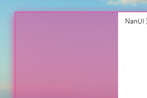
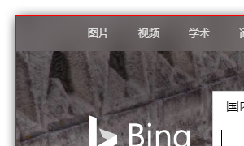
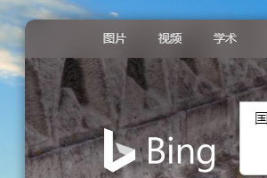

# Use Borderless Style Form

[[Home](README.md)]

- [Use Borderless Style Form](#use-borderless-style-form)
  - [BorderEffect Border Effect](#bordereffect-border-effect)
  - [ShadowEffect Shadow effect](#shadoweffect-shadow-effect)

Specify the property value `Borderless` for the `WindowType` of the Formium form to set the form style to borderless style. The borderless style removes the title bar and borders of the native system, and you can use the entire form area to draw your application interface.

Borderless windows have a unique collection of style properties, which you can access through the `BorderlessWindowProperties` property. Below, these attributes will be described in detail.

## BorderEffect Border Effect

NanUI has built-in three styles for Formium's borderless forms: `Borderless`, `Wireframe Border`, and `Rounded Border`.

- **None**

  Borderless style. After setting this style, the Formium will not draw borders, and the browser will occupy all the client area.

  ```C#
  BorderlessWindowProperties.BorderEffect = BorderEffect.RoundCorner;
  ```

  

  You can use the Border property of CSS to set the border of the top element to achieve the effect of having a border.

  

  ```html
  <div class="main-window">contents...</div>
  ```

  ```css
  .main-window {
    height: 100%;
    box-sizing: border-box;
    border: 1px solid #666;
  }
  ```

- **BorderLine**

  Edge border style. After setting this style, the edge of the form will be drawn by .NET.

  ```C#
  BorderlessWindowProperties.BorderEffect = BorderEffect.BorderLine;
  BorderlessWindowProperties.BorderColor = Color.Red;
  // BorderlessWindowProperties.InactiveBorderColor = Color.DarkRed;
  ```

  Set the `BorderColor` property to set the border color in the active state of the window; set the ʻInactiveBorderColor` property to set the border color in the inactive state. When ʻInactiveBorderColor` is set to NULL, NanUI will automatically use the color value of `BorderColor` to calculate a suitable color for the border of the Formium window.

  

- **RoundCorner**

  After setting the rounded border style, the four corners of the window will be rounded, and the whole window will become a rounded rectangle. It is not recommended to set the edge effect for the rounded border form, because the edges of the four corners will be cut off.

  ```C#
  BorderlessWindowProperties.BorderEffect = BorderEffect.RoundCorner;
  ```

  

## ShadowEffect Shadow effect

The `ShadowEffect` property body of the Formium borderless window has four optional effects: `no shadow`, `halo`, `shadow` and `projection`.

```C#
BorderlessWindowProperties.ShadowEffect = BorderEffect.Shadow;
```

- **None**

  No shadows. Turn off the shadow effect of the Formium window.

  

- **Glow**

  Halo effect.

  

- **Shadow**

  Shadow effect.

  

- **DropShadow**

  Projection effect.

  

The shadow also supports setting the color. Set the `ShadowColor` property to set the shadow color in the active state of the window; set the ʻInactiveShadowColor` property to set the shadow color in the inactive state. When ʻInactiveShadowColor` is set to NULL, NanUI will automatically calculate a suitable color based on the color value of `ShadowColor` for the shadow of the Formium window.
